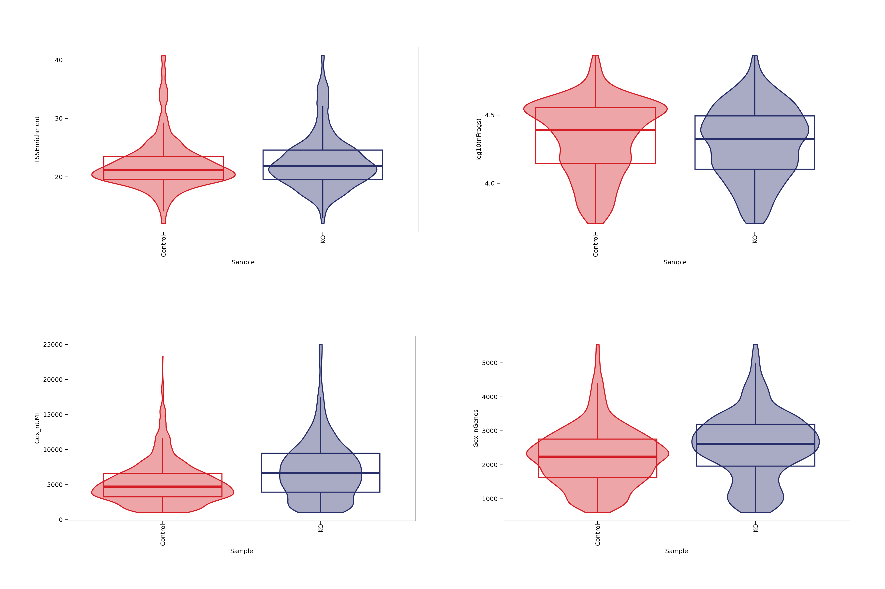
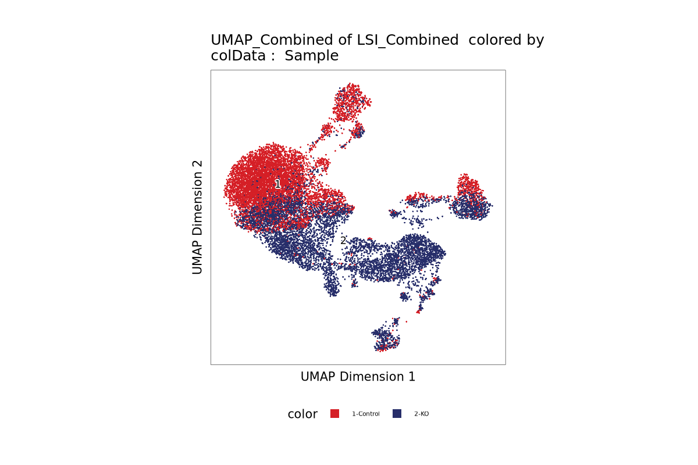
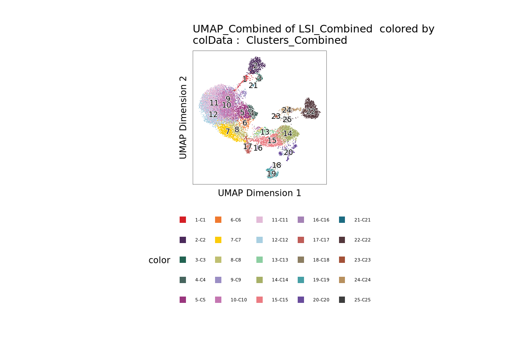
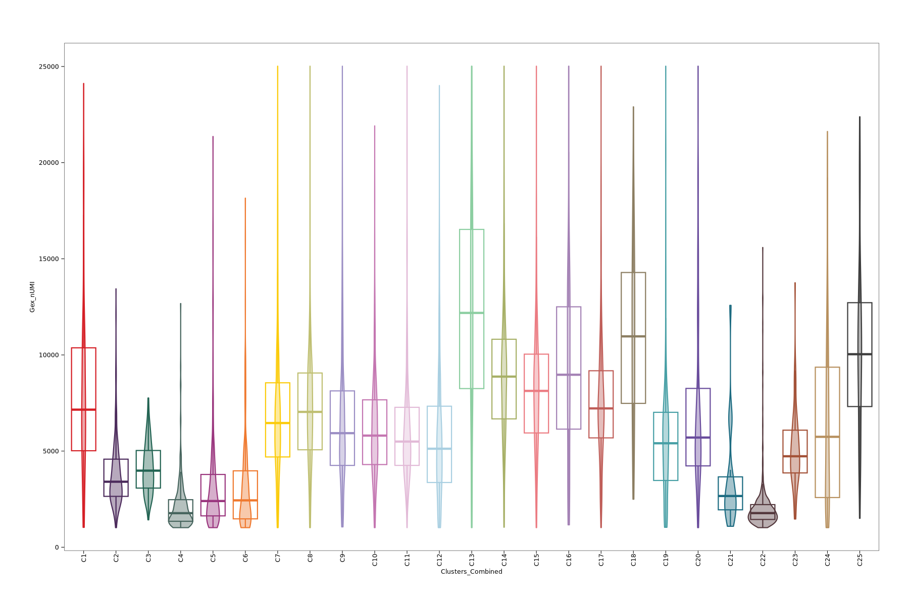

# Neurog2 Multiomics 

## QC before filtering 

## After filtering 

We used the following filtering parameters:

We used the following filtering parameters:

| Parameter       | Description                           | Default Value |
|-----------------|---------------------------------------|---------------|
| `minTSS`        | Minimum TSS enrichment for ATAC cells | 10            |
| `minFrags`      | Minimum number of ATAC fragments      | 5,000         |
| `minGexUMI`     | Minimum number of RNA UMIs per cell   | 1,000         |
| `maxGexUMI`     | Maximum number of RNA UMIs per cell   | 30,000        |
| `minGexGenes`   | Minimum number of genes detected      | 500           |
| `maxGexGenes`   | Maximum number of genes detected      | 7,000         |

### Number of cells per sample before filtering

| Sample  | Cells |
|---------|-------|
| Control | 7283  |
| OE      | 7561  |

### Number of cells per sample after filtering

| Sample  | Cells |
|---------|-------|
| Control |  7238 |
| OE      |  7561 |

## Adding UMAP and clustering 

 
