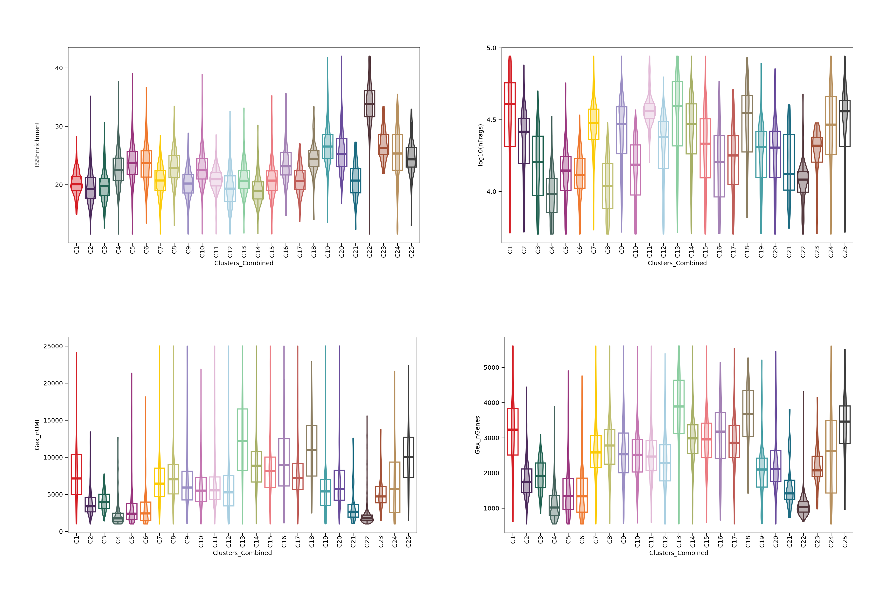

# Neurog2 Multiomics 

| Metric                              | Count  |
|-------------------------------------|--------|
| Number of ATAC cells                | 23,969 |
| Number of RNA barcodes              | 22,105 |

## Before filtering 

| cell_type | ATAC_only | ATAC+RNA |
|-----------|-----------|----------|
| **Total** | 2,305     | 21,664   |

| Condition | Control | KO    |
|-----------|---------|-------|
| **Total** | 11,409  |12,560 |

## QC before filtering 

## After filtering 

We used the following filtering parameters:

We used the following filtering parameters:

| Parameter       | Description                           | Default Value |
|-----------------|---------------------------------------|---------------|
| `minTSS`        | Minimum TSS enrichment for ATAC cells | 10            |
| `minFrags`      | Minimum number of ATAC fragments      | 5,000         |
| `minGexUMI`     | Minimum number of RNA UMIs per cell   | 1,000         |
| `maxGexUMI`     | Maximum number of RNA UMIs per cell   | 30,000        |
| `minGexGenes`   | Minimum number of genes detected      | 500           |
| `maxGexGenes`   | Maximum number of genes detected      | 7,000         |

### Number of cells per sample before filtering

| Sample  | Cells |
|---------|-------|
| Control | 11409 |
| KO      | 12560 |

### Number of cells per sample after filtering

| Sample  | Cells |
|---------|-------|
| Control | 7282  |
| KO      | 7560  |

## Adding UMAP and clustering 

## Per Clusters QC 

# Marker Genes

  

  

  

  

  

  

  

  

  

  

  

  

  

  

  

  

  

 

# Refining 

### After removing clusters 1, 2, 3, 4, 5, 6, and 21

 

 
