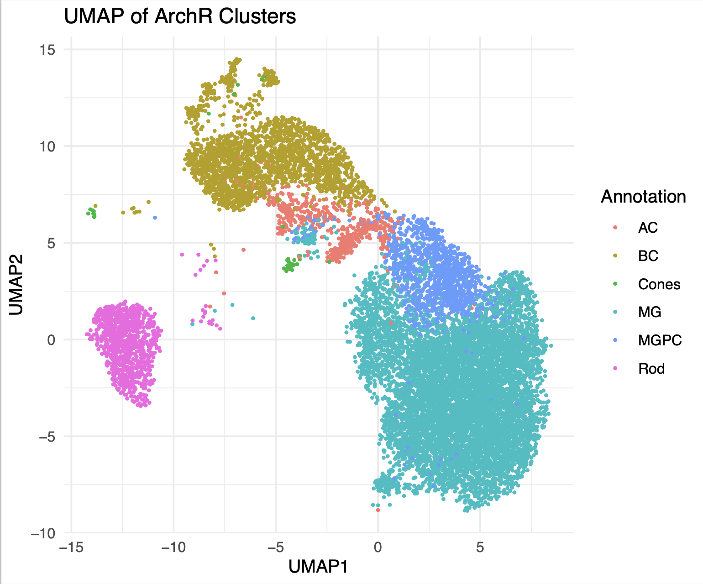
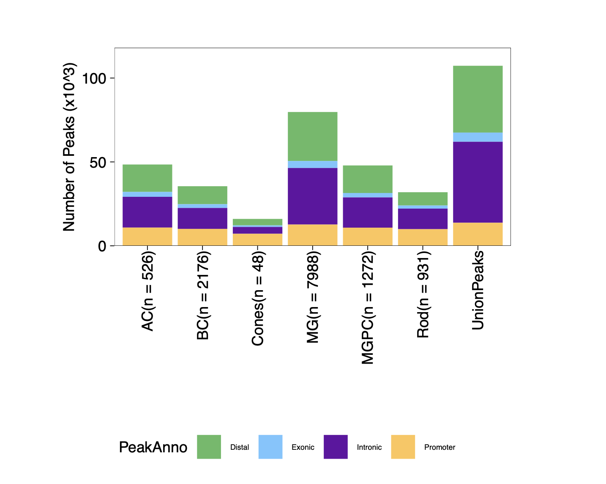
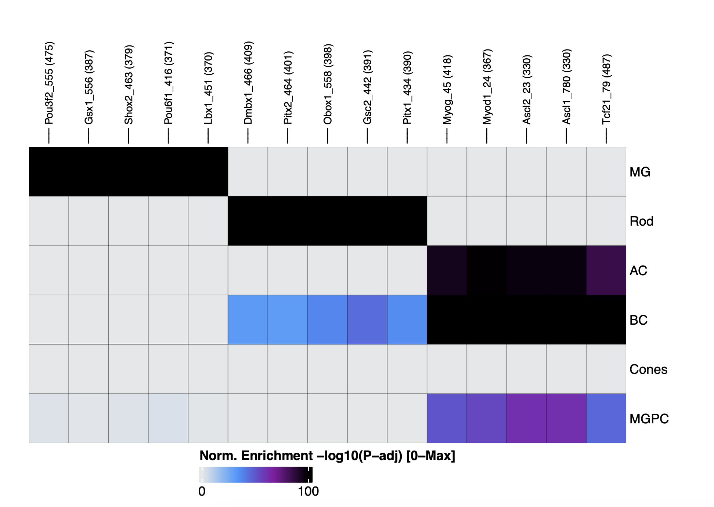

# Neurog2 Multiomics 

## QC before filtering 

Sample distribution changes:
   Sample Pre_Filter Post_Filter Retention_Rate
1 Control      11409        7283          63.84
2      OE      12560        7561          60.20

## After filtering 

We used the following filtering parameters:

| Parameter       | Description                           | Default Value |
|-----------------|---------------------------------------|---------------|
| `minTSS`        | Minimum TSS enrichment for ATAC cells | 10            |
| `minFrags`      | Minimum number of ATAC fragments      | 5,000         |
| `minGexUMI`     | Minimum number of RNA UMIs per cell   | 1,000         |
| `maxGexUMI`     | Maximum number of RNA UMIs per cell   | 30,000        |
| `minGexGenes`   | Minimum number of genes detected      | 500           |
| `maxGexGenes`   | Maximum number of genes detected      | 7,000         |

### Number of cells per sample after filtering

| Sample  | Cells |
|---------|-------|
| Control |  7238 |
| OE      |  7561 |

## Adding UMAP and clustering 

# Marker Genes

  

  

  

  

  

  

  

  

  

  

  

  

  

  

  

  

  

 

# ⚠️🚨 **ATTENTION! IMPORTANT NOTICE** WILL NEED TO RE-ANNOTATE 🚨⚠️

# Annotations 

# DGE Heatmap 

# Peaks 

 

# Motifs

 

 
