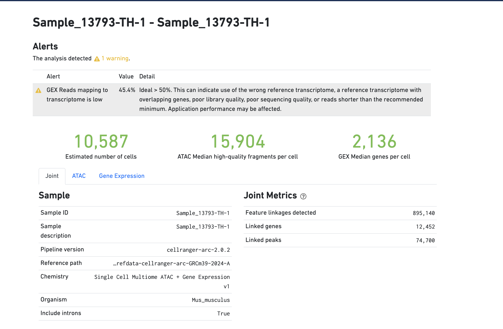
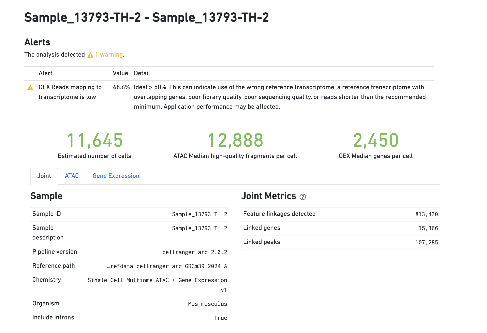
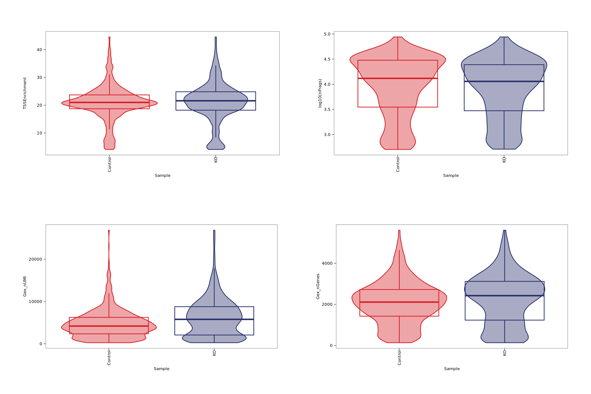
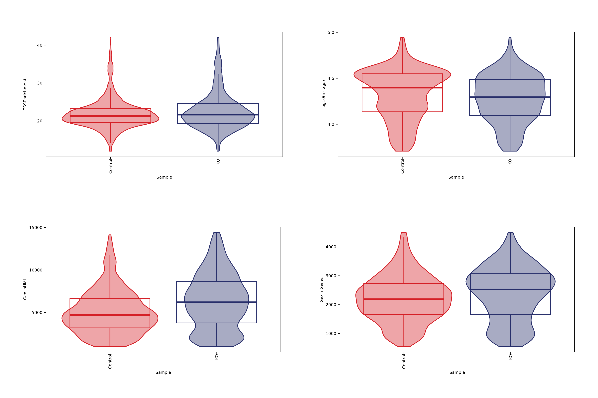

# Neurog2 Multiomics 


## Cell Ranger summary 





## Before Filtering QC Summary

**Cell types:**

| Cell type  | Number of cells |
|------------|----------------|
| ATAC_only  | 2              |
| ATAC+RNA   | 31             |

**Number of cells per sample before filtering:**

| Sample   | Number of cells |
|----------|----------------|
| Control  | 20             |
| KO       | 13             |

## Before Filtering QC Plots

The figure below shows QC metrics for the Neurog2 project before filtering:


## No. of cells 

```r
# 1️⃣ Clean ATAC barcodes from proj_ALL
atac_clean <- gsub(".*#", "", rownames(proj_ALL@cellColData))
cat("Number of ATAC cells:", length(atac_clean), "\n")

# 2️⃣ Clean RNA barcodes from the combined SE
rna_clean <- gsub("-1$", "", colnames(seRNAcombined))
cat("Number of RNA barcodes:", length(rna_clean), "\n")

# 3️⃣ Optional: count how many are in both
common_cells <- intersect(atac_clean, rna_clean)
cat("Number of barcodes present in both ATAC and RNA:", length(common_cells), "\n")


| Metric                              | Count  |
|-------------------------------------|--------|
| Number of ATAC cells                | 33     |
| Number of RNA barcodes              | 22,232 |
| Number of barcodes present in both  | 0      |

``` 


# re-align FASTQ files using cellranger-arc to mm10 


| Metric                              | Count  |
|-------------------------------------|--------|
| Number of ATAC cells                | 23,969 |
| Number of RNA barcodes              | 22,105 |

## Before filtering 


| cell_type | ATAC_only | ATAC+RNA |
|-----------|-----------|----------|
| **Total** | 2,305     | 21,664   |


| Condition | Control | KO    |
|-----------|---------|-------|
| **Total** | 11,409  |12,560 |


## QC before filtering 



## After filtering 

We used the following filtering parameters:

| Parameter       | Description                           | Default Value |
|-----------------|---------------------------------------|---------------|
| `minTSS`        | Minimum TSS enrichment for ATAC cells | 10            |
| `minFrags`      | Minimum number of ATAC fragments      | 5,000         |
| `minGexUMI`     | Minimum number of RNA UMIs per cell   | 1,000         |
| `maxGexUMI`     | Maximum number of RNA UMIs per cell   | 15,000        |
| `minGexGenes`   | Minimum number of genes detected      | 500           |
| `maxGexGenes`   | Maximum number of genes detected      | 5,000         |


Number of cells per sample after filtering:

| Condition | Control | KO    |
|-----------|---------|-------|
|**Total**  |  7179   | 7205  |





